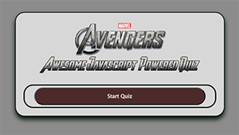
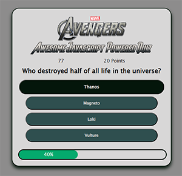
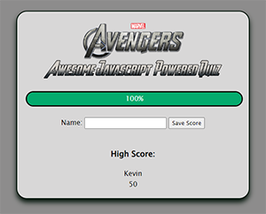

# Marvel's Avengers Quiz by Kevin Callaghan

## Description

This Avengers Quiz is made to not only test your knowledge of the Avengers, but also to test my ability to progress through a quiz using javascript.  As you click through the questions, I loop through an array to update the page with the next question while counting down the timer and adding up your score.

Once you have completed the quiz, you are able to enter your name and save your score to try and beat it the next time through!

After many attempts and failures, this quiz finally came together.  I learned a lot about navigating through my variables and elements to manipulate the different parts of the quiz, the scoring, the time, and the submission to local storage.

## Table of Contents (Optional)

If your README is long, add a table of contents to make it easy for users to find what they need.

- [Usage](#usage)
- [Credits](#credits)
- [License](#license)

## Usage

Here is a link to the deployed Quiz: https://kevincallaghan.github.io/Awesome-Code-Quiz/ 

Once the page loads and you are ready to begin, go ahead and click "Start Quiz" to begin the timer and view the first question.  Click the correct answers until you are 100% done with the questions.  After you have completed the quiz, you and enter your name to save your score.

Here is an example of the Start Screen:
    

Here is an example of the Questions:
    

Here is an example of the Score Screen:
    
 

## Credits

1. I learned how to make the buttons grow when hovering from 30secondeofcode.org in an article written by Angelos Chalaris called "Button Grow Animation" (2021).  Here is a link to the article: https://www.30secondsofcode.org/css/s/button-hover-grow-animation/#:~:text=Use%20the%20%3Ahover%20pseudo%2Dclass,the%20user%20hovers%20over%20it.

2. I used an article on codingartistweb.com called "Quiz App With Javascript to get an idea of what variables I will need to pull from my html for use in functions and also how to set up a timer.  I used the same idea of the timer to then make the progressElement.  This article was very helpful in getting an understanding of the task at hand.  Here is a link to the article: https://codingartistweb.com/2022/06/quiz-app-with-javascript/ 

3. I found an article on  that showed me how to create a progress bar.  I changed it a little to fit more how we learned to write in our class, but I used the idea and the ID names from the example.  Here is the link to the article: https://www.w3schools.com/howto/howto_js_progressbar.asp

4. I found a timer on Stack Overflow that seemed very much like what I was wanting.  I copied the timer from an answer to the featured question.  The answer was written by Lorenzo Cinque.  Here is a link to the page: https://stackoverflow.com/questions/30427882/make-a-timer-using-setinterval 

5. 

## License

Please refer to the LICENSE document in the repository for License Information